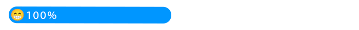

## Hi there 👋

  <h2>🙋 About Me :</h2>
  

    I have been programming for 3 years, and I’ve had a passion for it since childhood. In my final year of middle school, I had a teacher who taught programming. That was 
    my first exposure to the world of coding, and it sparked my interest even more. After a few years, I got the opportunity to learn programming again from the same 
    teacher, and this time I delved deeper into it. Now, alongside web design, I am learning AI specialties, and every day my passion for this field grows.
      
    I work in the field of web design, with several years of experience in building a variety of websites. My focus is on creating websites that are not only visually appealing but also optimized for performance and user experience. Currently, I am actively learning artificial intelligence to integrate cutting-edge technologies with web design, providing innovative and effective solutions for businesses. My expertise includes various programming languages, and I am always striving to learn and update my skills to offer the best services to my clients.
  

   
  

    من ۳ سال است که برنامه‌نویسی کار می‌کنم و این علاقه را از کودکی در خودم حس می‌کردم. در سال آخر راهنمایی بود که معلمی داشتم که برنامه‌نویسی تدریس می‌کرد. این اولین بار بود که با دنیای کدنویسی آشنا شدم و علاقه‌ام به آن بیشتر شد. بعد از چند سال، دوباره همان معلم به من برنامه‌نویسی را آموزش داد و این‌بار با عمق بیشتری وارد این حوزه شدم. اکنون در کنار طراحی سایت، به یادگیری تخصص‌های هوش مصنوعی پرداخته‌ام و هر روز بیشتر به این حوزه علاقه‌مند می‌شوم.
      
    من در زمینه طراحی وب‌سایت فعالیت می‌کنم و تجربه‌ای چندین‌ساله در ساخت وب‌سایت‌های متنوع دارم. تمرکزم بر روی ایجاد سایت‌هایی است که هم از لحاظ ظاهری جذاب باشند و هم از لحاظ عملکردی بهینه و کاربرپسند. در حال حاضر، به‌صورت فعال در حال یادگیری هوش مصنوعی هستم تا بتوانم تکنولوژی‌های نوین را با طراحی وب تلفیق کرده و راهکارهای خلاقانه و مؤثری برای کسب‌وکارها ارائه دهم. تخصص من شامل زبان‌های برنامه‌نویسی مختلفی است و همیشه به‌دنبال یادگیری و به‌روزرسانی مهارت‌های خود هستم تا بتوانم بهترین خدمات را به مشتریانم ارائه کنم.

  

 
 

 

  
   
   
  

      <h3>🤙 I work with the following programming languages ​​and frameworks : </h3>
     
       
      <lable>Learning more ...</lable> 
       
        
    <h3>🎨 Graphic :</h3>
       
    <h3>👌 and other tools ... :</h3>
       
    <h3>🧑‍💻 Learning the following technologies :</h3>
       
  

